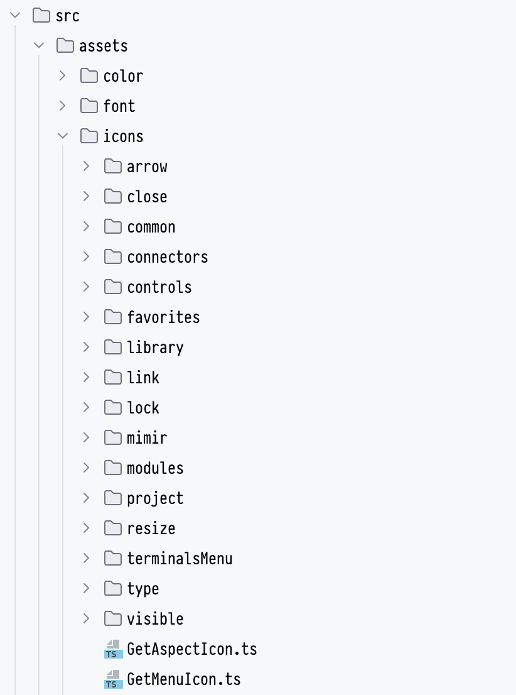

# Moving components to the component library.

There are some simple tasks that need to be done to clean things up a bit. These are not urgent, but I'm including a
list of things we know need to be moved; it's quite possible there are more.

## Assets

One of the simplest things to move right now are the icons used in Mimir; these belong in the component library. There
is also an issue that has arisen somewhere with the `alt` prop for these icons that needs to be fixed at some point.
Check A11y best practices to find out whether SVG icons need an alt prop or not.

The icons to be moved are currently located here (`/src/assets/icons/`):

There are also several things that have no business being in the Assets folder, such as `Size.ts`, as this would be
better suited in, for example, a `lib` folder or similar.

## src/client/src/compLibrary

In this folder, you will find several components that can be moved, but it needs to be checked whether it is necessary
or advantageous to move these components. It's quite possible that some of them are too tailored to Mimir to make it
worthwhile to move them, but most of the components here can probably be moved or replaced with already existing
components in the component library.
