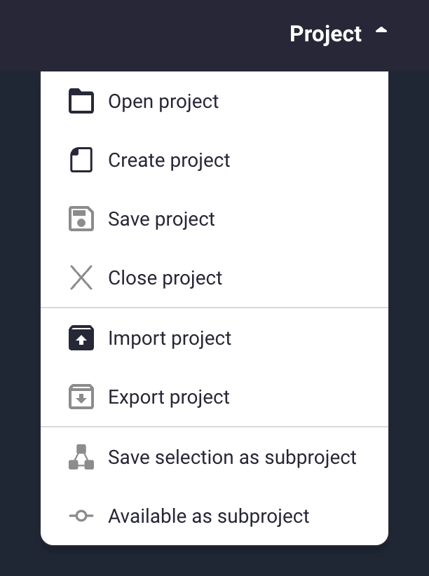
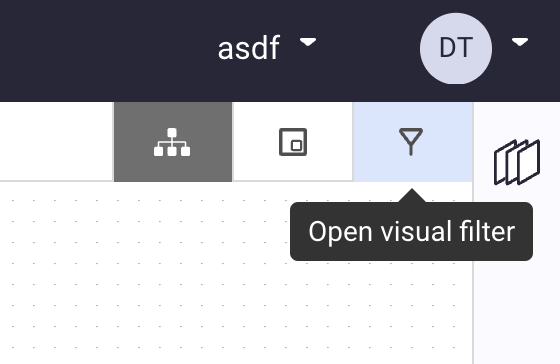
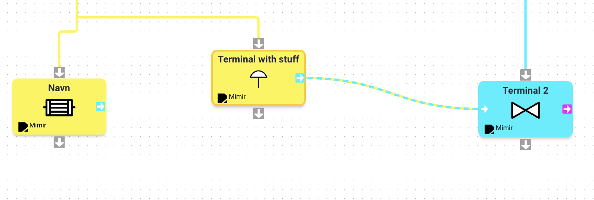
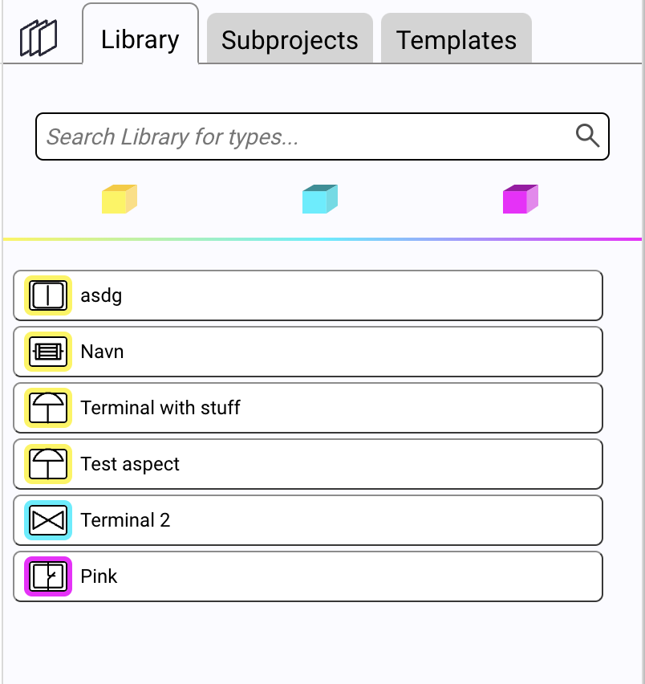
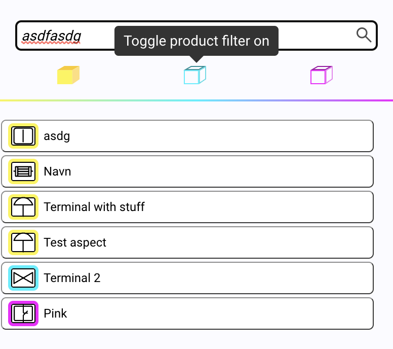
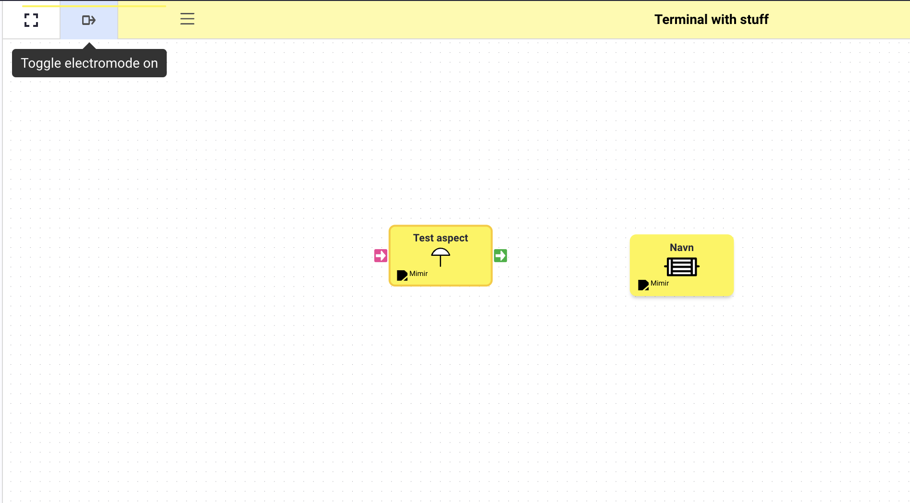
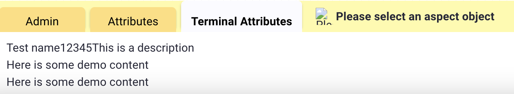
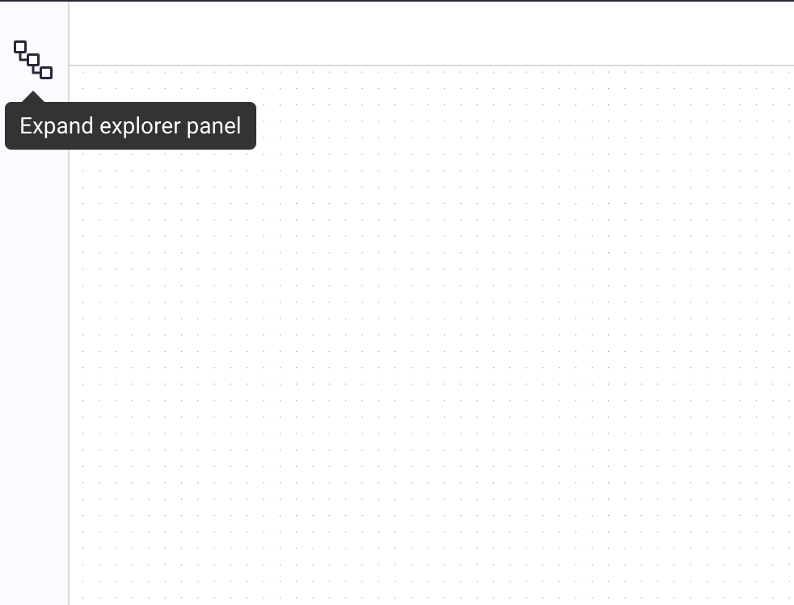

# New Components and Functionality

:::caution Note
When it comes to displaying elements, it's important that elements are only visually removed, not actually
removed from the tree, as this will cause the project state to change via React Flow.
:::

## Main Menu

On the start screen today, there are several buttons that do nothing:

- Open project: is not implemented.
- Create project: is partially implemented but instantiation project constructor is hardcoded.
- Save project: is partially implemented. We can save projects, but not updated existing projects.
- Close project: not implemented.
- Import project: not implemented.
- Export project: not implemented.
- Subproject functionality: no implemented.

## Visual Filter

The visual filter is currently not working; this menu should open a modal that allows you to turn on and off edges in
the graph in the drawing window. You should choose whether to display parent-child edges or edges between different
nodes (think left/right edges). It should (or at least used to) be possible to turn animations on and off for edges
between nodes.

## Library Module

You can't filter in this module (on the right in Mimir) today. This should be a simple task to implement.

## Block View

In block view, it should be possible to rotate the viewport 90 degrees so that those who are used to drawing from top to
bottom can use this view (this view is called electromode).

Sorting of terminals would also be nice here, as a Block can have many terminals, and to avoid edges between
nodes getting tangled.

## Inspector Module

In the inspector module, it should be possible to edit block data. Name, description, attributes etc.
This is in progress. And has been remade based on the components and structure used in the Library module. But a lot of
work still remains. None of the forms for input has been implemented.

## Explorer Panel

This is the panel on the left in Mimir's menu; this needs to be re-implemented. It should only display the entire
drawing area as a tree structure, think of the document tree structure in your IDE for example. It should also be
possible to turn off the display of nodes and the entire "tree" in this menu.

## Lock and Delete

Delete should remove the node from the drawing area; a reset button would probably be nice here too.

Lock doesn't need to be considered right now, as this functionality is to lock it so that others can't edit the node
while you're working on it. Since Mimir hasn't implemented web-sockets today, this button is also not in use. As it
doesn't push any state changes to the backend.

## Connection frontend to Backend

Connecting to backend is possible in the current state but will cast a few exceptions. In order to get it up and running
again is to first of all remove the query for company(as this is removed from Tyle) and ensure that data models in
frontend are updated.

After doing so, the remaining work of connection front and backend can continue.
Note that there are several methods in backend that will respond with no or limited data as the whole Mimir project is
in a transitional state.

:::caution Note
Given our limited knowledge there will probably be more issues tied to connecting frontend, backend and DB together.
:::
