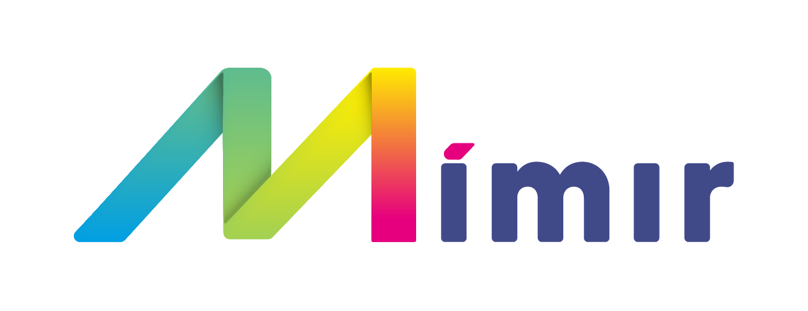

<div align="center">
  <p>
    A tool for building semantically supported facility data!
  </p>

<!-- Badges -->
<p>
<a href="https://github.com/mimir-org/mimir/actions/workflows/main.yaml">
    
  </a>

  <a href="https://github.com/mimir-org/mimir/graphs/contributors">
    
  </a>

  <a href="https://github.com/mimir-org/mimir/commits/main">
    
  </a>

  <a href="https://github.com/mimir-org/mimir/issues/">
    
  </a>

  <a href="https://github.com/mimir-org/mimir/blob/master/LICENSE">
    
  </a>

  <a href="https://github.com/mimir-org/mimir/releases">
  
  </a>

  <a href="https://hub.docker.com/repository/docker/mimirorg/mimir-client">
  
  </a>

  <a href="https://hub.docker.com/repository/docker/mimirorg/mimir-client">
  
  </a>
</p>

  <h4>
    <a href="https://github.com/mimir-org/mimir/issues">Report a bug or register a feature</a>
  </h4>
</div>

<br />

# Introduction

Mimir is currently not in active development. This documentation is primarily meant as a guide for potential new
developers to start active development again, and to inform about the current state of the code base, as well as future
plans for development that the previous team had.

<!-- About the Project -->

## :star2: About the Project

<!-- TechStack -->

### :space_invader: Tech Stack

<details>
  <summary>Client</summary>
  <ul>
    <li><a href="https://www.typescriptlang.org/">Typescript</a></li>
    <li><a href="https://reactjs.org/">React.js</a></li>
    <li><a href="https://reactrouterdotcom.fly.dev/">React Router</a></li>
    <li><a href="https://react-hook-form.com/">React Redux</a></li>
    <li><a href="https://styled-components.com/">styled-components</a></li>
    <li><a href="https://reactflow.dev/">React Flow</a></li>
    <li><a href="https://styled-icons.dev/">styled-icons</a></li>
    <li><a href="https://threejs.org/">three.js</a></li>
  </ul>
</details>

<details>
  <summary>Server</summary>
  <ul>
    <li><a href="https://dotnet.microsoft.com/en-us/languages/csharp">C#</a></li>
    <li><a href="https://docs.microsoft.com/en-us/aspnet/core/">ASP.NET</a></li>
    <li><a href="https://www.newtonsoft.com/json">Json.NET</a></li>    
    <li><a href="https://docs.microsoft.com/en-us/ef/">Entity Framework</a></li>
    <li><a href="https://automapper.org/">AutoMapper</a></li>
    <li><a href="https://xunit.net/">xUnit.NET</a></li>  
    <li><a href="https://github.com/domaindrivendev/Swashbuckle.AspNetCore">Swashbuckle</a></li>    
    <li><a href="https://github.com/moq/moq4">Moq</a></li>
    <li><a href="https://github.com/pankleks/TypeScriptBuilder">TypeScriptBuilder</a></li>
    <li><a href="https://dotnetrdf.org/">dotNetRDF</a></li>
  </ul>
</details>

<details>
<summary>Database</summary>
  <ul>
    <li><a href="https://www.microsoft.com/en-us/sql-server/">MSSQL</a></li>
  </ul>
</details>

<details>
<summary>DevOps</summary>
  <ul>
    <li><a href="https://www.docker.com/">Docker</a></li>
    <li><a href="https://www.nuget.org/">NuGet</a></li>
    <li><a href="https://github.com/features/actions">Github Actions</a></li>
    <li><a href="https://www.npmjs.com/">NPM</a></li>
  </ul>
</details>

<!-- Env Variables -->

### :key: Environment Variables

<!-- Client environment variables -->
<details>
<summary>Client</summary>

To set environment variables for client in development, edit the .env file. For production build, you have to set the
environment variables into the container itself. You can override the .env with a .env.local file. This file is not
included in git repo.

`REACT_APP_API_BASE_URL` - Url to backend server

`REACT_APP_SOCKET_BASE_URL` - Url to backend server used with websocket connection

`REACT_APP_APP_ID` - Application id of server app registration in Azure AD

`REACT_APP_CLIENT_ID` - Application id of client app registration in Azure AD

`REACT_APP_TENANT_ID` - Azure tenant

`REACT_APP_MIMIR_VERSION` - The Mimir version number

`REACT_APP_APP_INSIGHTS_CONNECTION_STRING` - Application insight connection string

`REACT_APP_SILENT` - Turn off MSAL connection

If you are running the server locally then the values will most likely be

```js
// where x and y = api version
REACT_APP_API_BASE_URL = http
://localhost:5001/v{x}.{y}/
REACT_APP_SOCKET_BASE_URL = http
://localhost:5001/
REACT_APP_APP_ID = xxxxxxxx - xxxx - xxxx - xxxx - xxxxxxxxxxxx
REACT_APP_CLIENT_ID = xxxxxxxx - xxxx - xxxx - xxxx - xxxxxxxxxxxx
REACT_APP_TENANT_ID = xxxxxxxx - xxxx - xxxx - xxxx - xxxxxxxxxxxx
REACT_APP_MIMIR_VERSION = 2.0
REACT_APP_APP_INSIGHTS_CONNECTION_STRING = InstrumentationKey = xxxxxxxx - xxxx - xxxx - xxxx - xxxxxxxxxxxx;
...
REACT_APP_SILENT = false
```

</details>

<!-- Server environment variables -->
<details>
<summary>Server</summary>

To set environment variables for server in development, edit the appsettings.json file. For production build, you have
to set the environment variables into the application container itself. You can override the appsettings.json with a
appsettings.local.json file. This file is not included in git repo.

`ASPNETCORE_ENVIRONMENT` - Set .NET core environment

`ApplicationSetting__CollaborationPartner__Name` - Name of default collaboration partner ex. Mimirorg

`ApplicationSetting__CollaborationPartner__Domain` - Domain of default collaboration partner ex. mimirorg.com

`ApplicationSetting__CollaborationPartner__Iris__0` - RDF domain of collaboration partner, e.g. rdf.mimirorg.com

`ApplicationSetting__TypeLibraryRootUri` - The root uri to Type Library

`ApplicationSetting__TypeLibraryVersion` - The version used by Type Library

`ApplicationSetting__TypeLibrarySecret` - The secret registered in Type Library. Used to identify and registered hooks

`ApplicationSetting__TypeLibraryDomain` - The type library domain

`AzureActiveDirectoryConfiguration__TenantId` - Azure tenant

`AzureActiveDirectoryConfiguration__ClientId` - Application id of Server application in Azure AD (app registration)

`AzureActiveDirectoryConfiguration__Silent` - Set authentication and authorisation in silent demo mode

`CorsConfiguration__ValidOrigins` - Comma separated string of valid origins for CORS.
E.g. http://localhost:3000,https://mimirorg.com

`DatabaseConfiguration__DataSource` - Identifier for database server

`DatabaseConfiguration__Port` - Port of database server. E.g. 1443

`DatabaseConfiguration__InitialCatalog` - Database name

`DatabaseConfiguration__DbUser` - Server application database username, must be db owner on given catalog

`DatabaseConfiguration__Password` - Server application database password

</details>

<!-- Prerequisites -->

### Prerequisites

This project uses .NET 6 for the server and NPM as package manager for the client,
make sure that you have these installed before continuing. Mimir has dependency on Type Library Service, so you also
need to clone that project for development purposes.
Clone that project as well if not running on external server. You also need a MSSQL database running on your machine.
See docker-compose for running sql in docker. Check out the [setup page](setup.md) for more information on getting
started.


<!-- Contributing -->

## :wave: Contributing

We welcome community pull requests for bug fixes, enhancements, and documentation.
See [How to contribute](./contribute.md) for more information.

<!-- Architecture sketches overall -->

## :department_store: Architecture

Architecture sketches overall.
See [Mimir overall](https://github.com/mimir-org/documents/blob/main/architecture/mimir_architecture_overall.pdf) for
more information.

<!-- Code of Conduct -->

### :scroll: Code of Conduct

This project has adopted the code of conduct defined by the Contributor Covenant to clarify expected behavior in our
community. For more information, see
the [.NET Foundation Code of Conduct](https://dotnetfoundation.org/about/code-of-conduct).

<!-- License -->

## :warning: License

Distributed under the MIT License. See [LICENSE](./license.md) for more information.

<!-- Contact -->

## :handshake: Contact

Mimir-org - orgmimir@gmail.com

Project Link: [https://github.com/mimir-org/mimir](https://github.com/mimir-org/mimir)

## License

MIT License

Copyright (c) 2022 mimir-org

Permission is hereby granted, free of charge, to any person obtaining a copy
of this software and associated documentation files (the "Software"), to deal
in the Software without restriction, including without limitation the rights
to use, copy, modify, merge, publish, distribute, sublicense, and/or sell
copies of the Software, and to permit persons to whom the Software is
furnished to do so, subject to the following conditions:

The above copyright notice and this permission notice shall be included in all
copies or substantial portions of the Software.

THE SOFTWARE IS PROVIDED "AS IS", WITHOUT WARRANTY OF ANY KIND, EXPRESS OR
IMPLIED, INCLUDING BUT NOT LIMITED TO THE WARRANTIES OF MERCHANTABILITY,
FITNESS FOR A PARTICULAR PURPOSE AND NONINFRINGEMENT. IN NO EVENT SHALL THE
AUTHORS OR COPYRIGHT HOLDERS BE LIABLE FOR ANY CLAIM, DAMAGES OR OTHER
LIABILITY, WHETHER IN AN ACTION OF CONTRACT, TORT OR OTHERWISE, ARISING FROM,
OUT OF OR IN CONNECTION WITH THE SOFTWARE OR THE USE OR OTHER DEALINGS IN THE
SOFTWARE.
