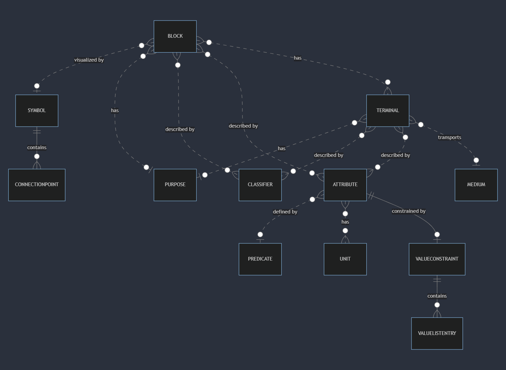

# Current state of the code base

## Backend

The primary job for the Tyle backend is to serve as a CRUD-application for creating IMF types, as well as forwarding
approved types to an external type library. Tyle currently uses Common Library as its type library.

The diagram above shows the dependencies between the different projects in the backend. We will go through these
projects, outlining their role in the application as a whole, and commenting on work that remains to be done.

There is barely any logging implemented in the backend. This should be prioritized to make debugging and managing
the server easier.

### Tyle.Core

Contains the core models and enums used to define the IMF types (attributes, terminals and blocks) and external
references (classifiers, media, predicates, purposes and units).

### Tyle.Application

Contains the request DTOs for creating and updating types and external references, as well as interfaces for the
repositories for types and external references. Also contains a service for the approval process of types, as well as
an interface for user information.

### Tyle.Converters

Contains the code used for exporting types from the domain models to the export format, JSON-LD. This project uses the
dotNetRdf package, which means adding new RDF export formats can be done very easily.

This project also contains all the IRIs used by the software. Some of these (for instance the symbol ontology IRIs) are
temporary, and when these change the application will fail.

### Tyle.Persistence

Contains the implementations of the repository interfaces. The data export to the type library is currently done by the
repositories, this should probably be moved to a separate project or service. The diagram below shows the rough database structure.

### Tyle.External

Contains the code used for fetching data from the external reference data library. The RDL used is either Common Library or
PCA, depending on the UseCommonLib environment variable.

### Mimirorg.Authentication

Contains the code used for authentication and authorization. Also contains code for sending e-mails. This code is
(mostly) disabled at the moment. E-mails notifying users of new users, request for types approval and so on should be
implemented. It should probably also be extracted to a separate project.

### Tyle.Api

Contains the startup code, controllers and views. The Data folder contains some json files containing symbols and
attributes that were used in a previous version of Tyle. These are no longer in use, and can be removed.

## Frontend

### Code structure

The `src` folder contains the following folders:

- `api` - contains code for communicating with the backend
- `components` - contains the React components of the app
- `helpers` - contains helper code that is used by more than one component
- `hooks` - contains custom hooks that are used by more than one component
- `types` - contains TypeScript type definitions

### Unfinished parts of the application

Some tasks that have been started in the frontend code has not been finished. This is mainly due to a big revamp of the
IMF types following the release of v2.1 of the IMF manual in July 2023, which lead to a need to update many of the
frontend components.

- Attribute groups are not functional in this version of the client. The idea of attribute groups is to make it easier
  to add attributes that are commonly applied together by bundling them in a group. A previous version of Tyle (v0.24)
  has a working (although minimal) application of this concept. The attribute groups are currently removed from the user interface,
  but are still present (but not fully implemented) in the backend code.
- Tyle previously used a component library common to Tyle and Mimir (which can be found on [Github](https://github.com/mimir-org/component-library)).
  This has been phased out, as it was complicated to update and work with. The needed code has been copied over to the Tyle
  code base. There are some issues with this:
  - Alot of the components are built using components from this component library like Flexbox and Box. These components make the
    code harder to read and work with. We recommend phasing them out, instead using Styled Components for building the layouts.
  - The theme code and all its types seem unnecessarily complex, and could probably be made easier to use and understand.
    Replacing this code could probably be part of a larger overhaul of the design/UI.
- Phasing out the use of React Hook Form and Yup. Some forms in the solution still use this package, we recommend updating
  these so that this package can be phased out. The solution we were aiming for would use HTML form validation, see the
  create attribute/terminal/block forms for examples. The React Hook Devtools are also visible in parts of the application,
  even in production builds.

## Database calls

As for many application in development, the database calls could be more efficient. This is also true for Tyle.
Some calls to DB seems excessive and should be reviewed.
