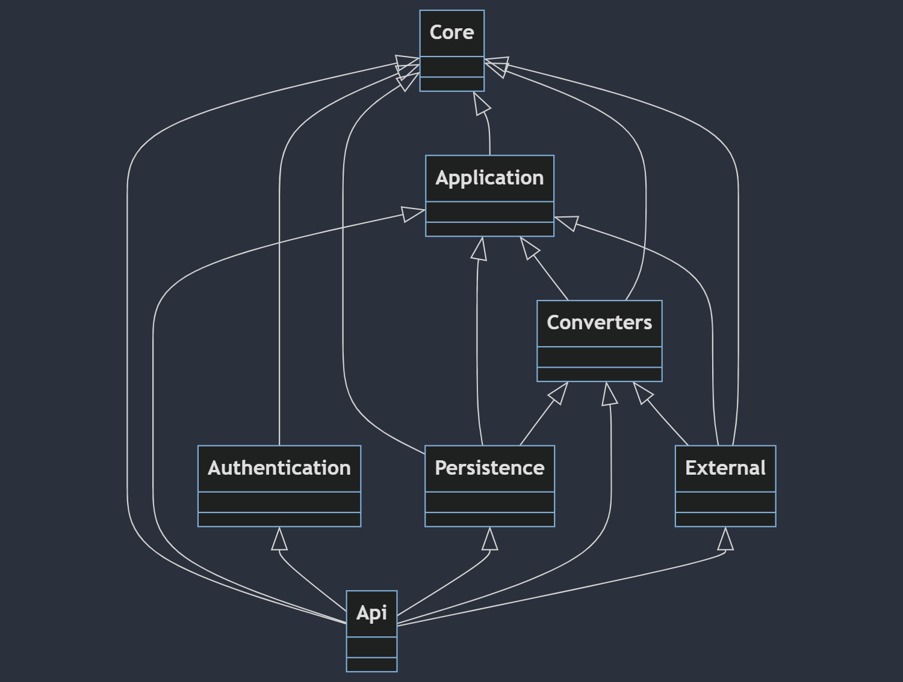

# Current state of the code base

## Backend

The primary job for the Tyle backend is to serve as a CRUD-application for creating IMF types, as well as forwarding
approved types to an external type library. Tyle currently uses Common Library as its type library.

The diagram above shows the dependencies between the different projects in the backend. We will go through these
projects, outlining their role in the application as a whole, and commenting on work that remains to be done.

### Tyle.Core

Contains the core models and enums used to define the IMF types (attributes, terminals and blocks) and external
references (classifiers, media, predicates, purposes and units).

### Tyle.Application

Contains the request DTOs for creating and updating types and external references, as well as interfaces for the
repositories for types and external references. Also contains a service for the approval process of types, as well as
an interface for user information.

### Tyle.Converters

Contains the code used for exporting types from the domain models to the export format, JSON-LD. This project uses the
dotNetRdf package, which means adding new RDF export formats can be done very easily.

This project also contains all the IRIs used by the software. Some of these (for instance the symbol ontology IRIs) are
temporary, and when these change the application will fail.

### Tyle.Persistence

Contains the implementations of the repository interfaces. The data export to the type library is currently done by the
repositories, this should probably be moved to a separate project or service.

### Tyle.External

Contains the code used for fetching data from the external reference data library. The code as is is directly geared
towards using Common Library for this, and should probably be rewritten to be more general, so switching reference data
libraries can be more easily done.

### Mimirorg.Authentication

Contains the code used for authentication and authorization. Also contains code for sending e-mails. This code is
(mostly) disabled at the moment. E-mails notifying users of new users, request for types approval and so on should be
implemented. It should probably also be extracted to a separate project.

### Tyle.Api

Contains the startup code, controllers and views.

## Frontend

### Code structure

The `src` folder contains the following folders:

- `api` - contains code for communicating with the backend
- `components` - contains the React components of the app
- `helpers` - contains helper code that is used by more than one component
- `hooks` - contains custom hooks that are used by more than one component
- `types` - contains TypeScript type definitions

### Unfinished parts of the application

Some tasks that have been started in the frontend code has not been finished. This is mainly due to a big revamp of the
IMF types following the release of v2.1 of the IMF manual in July 2023, which lead to a need to update many of the
frontend components.

- Attribute groups are not functional in this version of the client. The idea of attribute groups is to make it easier
  to add attributes that are commonly applied together by bundling them in a group. A previous version of Tyle (v0.24)
  has a working (although minimal) application of this concept. The attribute groups are currently removed from the latest release.
- Phasing out the use of React Hook Form. Some forms in the solution still use this package, we recommend updating
  these so that this package can be phased out.
- There is some unused code as well as some code that is commented out in the frontend code base that should be
  removed.
- The application does not have any logging. This should be added.
- Admin has no possibility to reject a user request for Tyle i.e. set role as none or completely remove the request. This should be added.

### Database calls
As for many application in development, the database calls could be more efficient. This goes also for Tyle.
Some calls to DB seems excessive and should be reviewed.