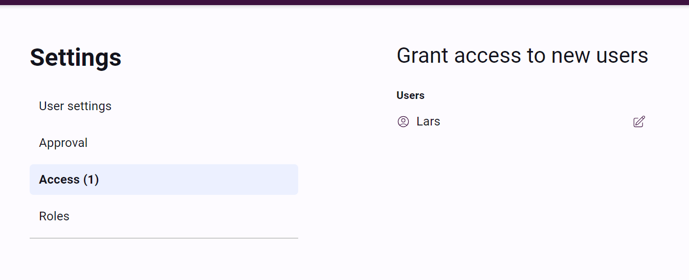
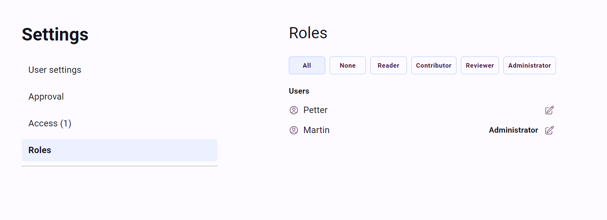

# Admin user options

## Approving new users

An admin user has the extended ability to approve new users in Tyle. This can be done in Settings - Access.
During the approving admin has the possibility to set role to the new user.

## Edit role to existing user

Editing role for users in Tyle is available for admin users only. This can be done in Settings - Roles.

