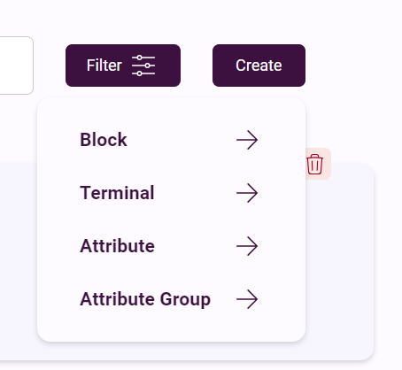
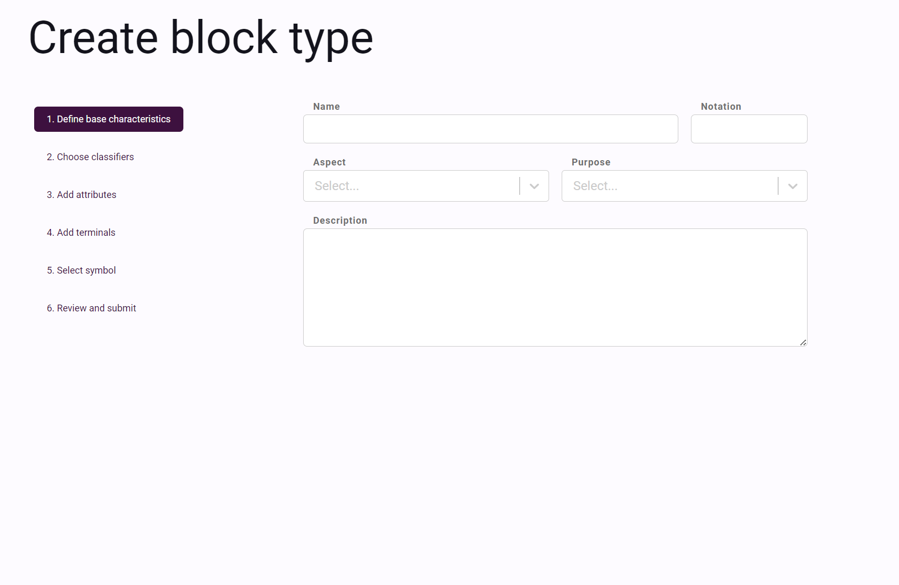

# Creating Types

If you don't have registered a Tyle user, you can read the [Registering new user page](registering-user.md). Here you will also find
usefull information about authenticator setup, login and how to get access (permissions).

This is the Tyle main page. Here you can search for types, create, edit, clone, delete and request approval or approve a
type (depending on your permission). The screenshot below shows a user that don't have any permissions yet, and the '
Create' button is disabled:

You can use the filter menu to filter the list for specific types:

When the user has 'Write' permission, he/she can create new objects:

In the screenshot below, the user creates a new 'Aspect Object':

When the aspect object is created it will have 'Draft' status. When in 'Draft' the user can choose to 'clone', 'edit', '
request approval' or 'delete' the object.

When the user is satisfied with the new type he/she can 'request approval' and the new status will be 'Pending
approval'. Then a user with minimum 'Approve' access needs to approve the new type. When it is approved you will receive
an email.