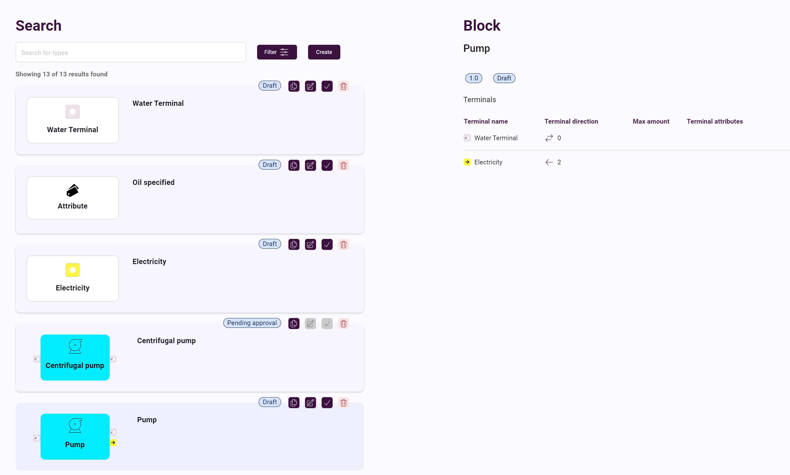

# Type Creation Process

If you have not yet registered as a Tyle user, please refer to the [User Registration Guide](registering-user.md). This
guide also provides valuable information on setting up authentication, logging in, and obtaining the necessary
permissions.

## Overview of the Tyle Main Interface

The Tyle main interface serves as a hub for various functionalities such as searching for types, creating, editing,
cloning, deleting, and either requesting or granting approval for a type, contingent upon your permission level. The
screenshot below illustrates an interface for a user without any permissions, where the 'Create' button is disabled:

### Utilizing the Filter Menu

The filter menu can be employed to narrow down the list to specific types:

### Type Creation

Users endowed with higher role than 'Read' have the capability to create new types:
In the following screenshot, a user initiates the creation of a new 'Block':

Complete the fields needed and proceed.

### Object Status and Actions

Upon creation, the aspect object will be in a 'Draft' status. During this phase, the user has the options to clone,
edit, request approval, or delete the object if all connected types (i.e. attributes and terminals) already are approved:

### Approval Process

Once the user is content with the newly created type, they can proceed to 'request approval'. The status will then
transition to 'Pending Approval'. Subsequently, a user with at least 'Approve' access level is required to validate the
new type. Upon approval, a confirmation email will be sent to you.
The below screenshot shows the admin table of approval type. Once it is approved it cannot be deleted or edited. This action send the type to centralized library for further use.

