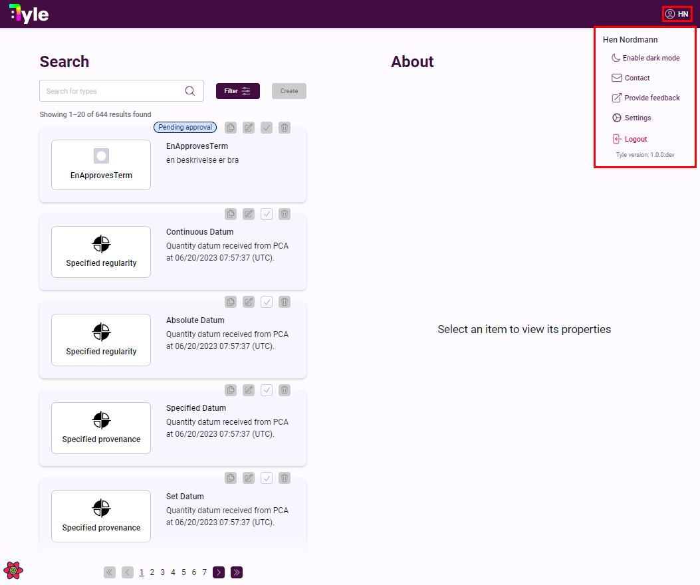

# Registering new user

Navigate to https://tyle.imftools.com and click 'Sign up':

In the 'Register' screen fill inn the required information and click 'Create account':

Tyle will now send an email to you with a registration code you need to enter in the fields. Remember to check your
email spam folder if you don't get an email:

Then you must use an authenticator and scan the QR code with the phone camera. We recommend using 'Microsoft
Authenticator' if you don't already have an authenticator installed on your phone. You can find the 'Microsoft
Authenticator' in the App store on your phone. To scan the Tyle QR code you can click the + icon at the top and then
choose personal or jobb account. When you have chosen the account type you click 'Scan QR code' and point your phone
camera at the QR code on the screen. When the QR code is scanned it will add a new account for Tyle in your
authenticator. Typically the name for the account will be your email addresses domain. We recommend you rename the
account entry in the authenticator to something like 'Tyle (production)':

After you have added Tyle to your authenticator click the 'Next' button:

The manager of your chosen organization has now recieved an email that you just registered and he/she needs to give you
an appropriate access level (beyond the basic access). The manager set the access level in the 'Access' page, and you
will receive an email when new access is given:

If you experience problems with the registration and/or QR code and/or authenticator and/or password you have the option
to click 'Account recovery' at the main login screen.

Your new Tyle account setup is now complete and you have read access to Tyle. Click 'Return' to goto the login screen:

In the login screen enter your email, password and the authenticator code (the code 447122 used in the screenshot is
just an example):

You will then be presented with the Tyle main page. And since you only have 'read access' you can't create new types. At
the top right corner you can look at your account and change some basic account settings. In this menu you will also
find the 'Contact' entry.:

If you click 'Contact' you can find the managers for the organizations. To be able to create new types the manager for
your chosen organization needs to give you higher access level than the basic 'read' access. If this is not done within
a reasonable amount of time you can find your manager email and send him/her a polite email that you need higher access
level:

When the manager have given you access, you can see your access level in your profile menu:

You will also receive an email when you are given a new access level.

You are now ready to create some types.

