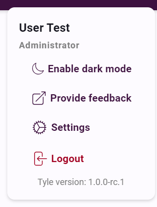

# User Registration Procedure

## Initial Steps

1. Navigate to Tyle offical webpage and select the 'Sign Up' option. The url can be provided by the project owner

2. On the 'Registration' interface, complete the required fields and click 'Create Account'.

## Email Verification

3. An email containing a registration code will be dispatched to your inbox. If you do not receive the email, please
   check your spam folder.

## Authenticator Setup

4. Utilize an authenticator application to scan the provided QR code. We recommend 'Microsoft Authenticator', available
   on your mobile device's app store. To scan the QR code, select the '+' icon, choose the account type, and then
   select 'Scan QR Code'.

5. After successfully adding Tyle to your authenticator, proceed by clicking 'Next'.

## Access Level Assignment

6. The administrator of your selected organization will receive a notification of your registration. They will assign
   your initial access level, and you will be notified via email.

## Account Recovery

7. Should you encounter issues with registration, QR code scanning, or authentication, the 'Account Recovery' option is
   available on the main login screen.

## Final Steps

8. Your Tyle account is now set up with read-only access. To log in, enter your email, password, and the code from your
   authenticator.

9. Upon successful login, you will be directed to the Tyle main interface. Your account settings can be accessed from
   the top-right corner of the screen.

## Requesting Additional Access

10. To request higher access levels, contact the organization's administrator. Their contact information can be found
    under the 'Contact' menu.

11. Once your access level has been updated, you will receive a confirmation email.

You are now prepared to engage with Tyle's functionalities.
